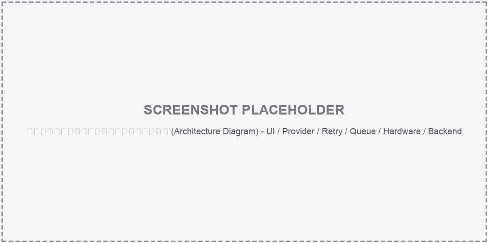
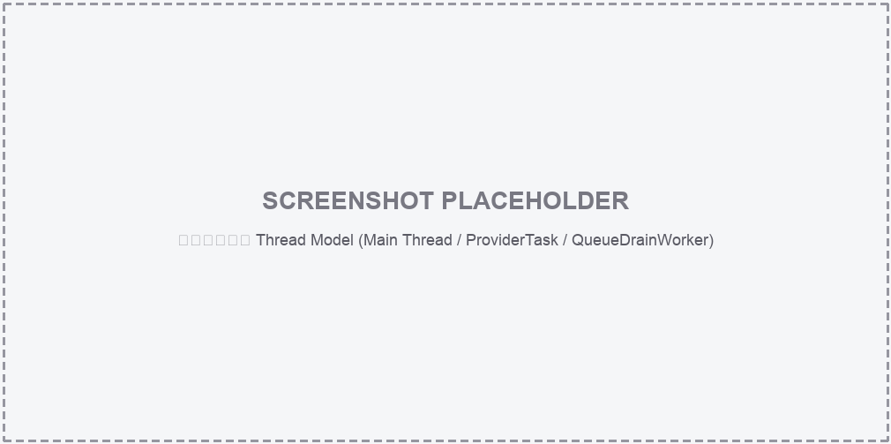
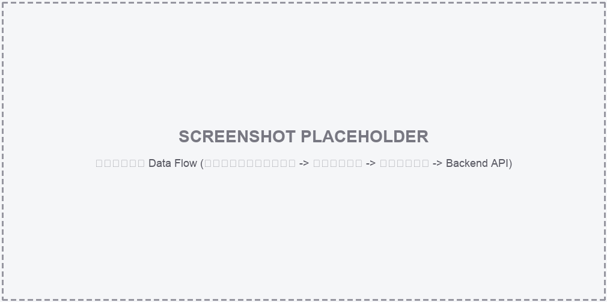

# CareKeeper — เอกสารสรุปโครงการฉบับสมบูรณ์

> เอกสารนี้รวบรวมข้อมูลทั้งหมดของโปรเจกต์ CareKeeper ไว้ในที่เดียว สำหรับใช้ประกอบการนำเสนอ/ส่งอาจารย์/ส่งต่อทีมงานใหม่ ครอบคลุมโครงสร้างโปรเจกต์ สถาปัตยกรรม ไลบรารีที่ใช้ โมดูลและฟังก์ชันการทำงาน ตัวแปรแวดล้อม (.env) การ deploy บน Raspberry Pi และข้อจำกัดที่ยังต้องพัฒนาต่อ
>
> **หมายเหตุเรื่องรูปภาพ:** ส่วนที่ต้องใช้ screenshot หรือ diagram จริง จะถูกใส่เป็น **placeholder template** ไว้ก่อน (กรอบเส้นประพร้อมคำอธิบายว่าเป็นรูปอะไร) ผู้จัดทำสามารถนำรูปจริงจากเครื่อง/โปรแกรมมาแทนที่ไฟล์ใน `docs/assets/` ตามชื่อไฟล์เดิมได้ทันที โดยไม่ต้องแก้เอกสารนี้

\newpage

## สารบัญ

1. ภาพรวมโครงการ (Project Overview)
2. วัตถุประสงค์และขอบเขต
3. สถาปัตยกรรมระบบ (Architecture)
4. โครงสร้างไฟล์ (Project Structure)
5. Libraries / Dependencies
6. ตัวแปรแวดล้อม (Environment Variables — `.env`)
7. รายละเอียดโมดูลและฟังก์ชัน (Module & Function Reference)
8. การจัดการ Thread และ Concurrency
9. Data Flow: จากบัตรประชาชนถึง Backend
10. หน้าจอของระบบ (UI Screens) — Template รูป
11. การติดตั้งและรันโปรแกรม (Setup & Run)
12. การ Deploy บน Raspberry Pi 5 (Kiosk Mode)
13. การทดสอบ (Testing)
14. การจัดการข้อผิดพลาดและการแจ้งเตือน
15. ข้อจำกัดปัจจุบันและงานที่ควรทำต่อ (Known Limitations / Roadmap)
16. ภาคผนวก (Appendix)

\newpage

## 1. ภาพรวมโครงการ (Project Overview)

**CareKeeper** เป็นระบบส่วนติดต่อผู้ใช้แบบกราฟิก (GUI) สำหรับเครื่องตรวจวัดสัญญาณชีพ (Vital Signs Kiosk) ที่ทำงานบน **Raspberry Pi 5** พัฒนาด้วยภาษา **Python 3** และ framework **PySide6 (Qt for Python)** ออกแบบมาสำหรับหน้าจอสัมผัสขนาด **1010 × 503 พิกเซล**

ระบบช่วยให้ผู้ใช้งาน (เช่น เจ้าหน้าที่สาธารณสุขหรือประชาชนทั่วไป) สามารถ:

- อ่านข้อมูลผู้รับบริการจากบัตรประชาชนไทย (Thai National ID Card) ผ่านเครื่องอ่านบัตร (Smart Card Reader / PC-SC)
- กรอกเลขบัตรประชาชนเองในกรณีเครื่องอ่านบัตรมีปัญหา
- วัดค่าความดันโลหิต (SYS/DIA), ชีพจร (Pulse), ออกซิเจนในเลือด (SpO2) และอุณหภูมิร่างกาย จากอุปกรณ์จริง
- แสดงผลค่าที่วัดได้แบบเรียลไทม์ พร้อมแยกสีตามชนิดข้อมูลเพื่อให้อ่านง่าย
- สรุปผลการวัดทั้งหมดในหน้าเดียว และส่งข้อมูล (JSON) ไปยัง Backend API ของโรงพยาบาล/ระบบ Telemedicine
- แสดงข้อมูลย้อนหลัง 4 รายการล่าสุดของผู้รับบริการ
- ทำงานต่อเนื่องได้แม้ไม่มีอินเทอร์เน็ต (Offline-first) ด้วยระบบคิวสำรองข้อมูล
- ทนทานต่ออุปกรณ์ที่เชื่อมต่อไม่สำเร็จ ด้วยระบบ retry + auto-disable

โปรเจกต์ถูกออกแบบให้แยกชั้นการทำงาน (UI / Provider / Retry / Queue / Logging) อย่างชัดเจน ทำให้สามารถพัฒนาและทดสอบ UI ด้วยข้อมูลจำลอง (Mock Mode) ได้โดยไม่ต้องพึ่งอุปกรณ์จริงตลอดเวลา และสลับไปใช้อุปกรณ์จริง (Real Hardware Mode) ได้ทันทีเมื่อพร้อม deploy บน Raspberry Pi

\newpage

## 2. วัตถุประสงค์และขอบเขต

| หัวข้อ | รายละเอียด |
| --- | --- |
| เป้าหมายหลัก | รวมการทำงานของอุปกรณ์ตรวจสุขภาพหลายชนิดไว้ในโปรแกรมเดียว ลดความซับซ้อนสำหรับผู้ใช้ทั่วไป |
| กลุ่มผู้ใช้งาน | เจ้าหน้าที่/อาสาสมัครสาธารณสุข, ประชาชนที่มาใช้ตู้ตรวจสุขภาพ |
| แพลตฟอร์มเป้าหมาย | Raspberry Pi 5 + จอสัมผัส 1010×503 พิกเซล, Raspberry Pi OS (labwc/Wayland) |
| ขอบเขตที่รองรับแล้ว | อ่านบัตรประชาชน, วัดความดัน/ชีพจร/SpO2, ส่งข้อมูล Backend, offline queue, retry/auto-disable, Wi-Fi/Bluetooth management, kiosk boot |
| ขอบเขตที่ยังไม่สมบูรณ์ | เซนเซอร์อุณหภูมิจริง (ยังเป็น placeholder ใน real mode), GET API ข้อมูลย้อนหลังจริง, log แบบไฟล์/journald |

\newpage

## 3. สถาปัตยกรรมระบบ (Architecture)

ระบบแบ่งเป็นเลเยอร์หลัก 5 ชั้น ทำงานร่วมกันดังนี้:

```
┌─────────────────────────────────────────────────────────────┐
│                     Presentation Layer (UI)                   │
│                      carekeeper_ui.py                          │
│   CareKeeperWindow / ProviderTask(QThread) / Popup / Toast     │
└───────────────┬─────────────────────────────┬─────────────────┘
                │ เรียกผ่าน interface           │ event callback
                ▼                             ▼
┌─────────────────────────────┐   ┌───────────────────────────────┐
│      Provider Layer           │   │   Reliability Layer            │
│   carekeeper_providers.py     │◄──┤  carekeeper_retry.py            │
│  CareKeeperProvider (ABC)     │   │  retry_with_notify /            │
│  ├─ MockCareKeeperProvider    │   │  SubsystemRegistry (auto-disable)│
│  └─ RealCareKeeperProvider    │   └───────────────────────────────┘
└───────┬───────────────┬───────┘
        │               │
        ▼               ▼
┌───────────────┐  ┌─────────────────────────────┐
│  Hardware I/O  │  │        Backend / Network      │
│  lib/thaiidcard│  │  requests.post() → Backend API │
│  lib/bp_monitor│  │  carekeeper_queue.py            │
│  lib/h59_ble   │  │  SubmissionQueue (SQLite)        │
│  lib/ups       │  │  QueueDrainWorker (thread)        │
└───────────────┘  └─────────────────────────────┘

┌─────────────────────────────────────────────────────────────┐
│                 Cross-cutting: carekeeper_logging.py           │
│         configure_logging() / log_thread_identity()            │
└─────────────────────────────────────────────────────────────┘
```

**หลักการออกแบบสำคัญ**

- **Dependency Inversion ระหว่าง UI กับ Hardware**: `CareKeeperWindow` ไม่เรียก hardware โดยตรง แต่เรียกผ่าน interface `CareKeeperProvider` ทำให้สลับ Mock ↔ Real ได้โดยไม่แก้โค้ด UI
- **Non-blocking UI**: งานที่รอ I/O (อ่านบัตร, วัดค่า, ส่ง API, สแกน Wi-Fi/Bluetooth) ทำงานใน `QThread` แยกจาก main thread เสมอ
- **Resilience by design**: ทุกการเรียกอุปกรณ์ห่อด้วย `retry_with_notify` และมี `SubmissionQueue` กันข้อมูลหายเมื่อออฟไลน์
- **Config over code**: ค่าที่เปลี่ยนบ่อย (API URL, API key, serial port, BLE address) อยู่ใน `.env` ไม่ hardcode ในโค้ด

### 3.1 แผนภาพสถาปัตยกรรม (Template)



*แทนที่ไฟล์ `docs/assets/diagram_architecture.png` ด้วยแผนภาพจริง (เช่น export จาก draw.io/Excalidraw) เมื่อมีพร้อม*

\newpage

## 4. โครงสร้างไฟล์ (Project Structure)

```text
Care_Keeper/
├── main_demo.py                # entry point: รัน GUI ด้วย MockCareKeeperProvider
├── main_real.py                # entry point: รัน GUI กับอุปกรณ์จริงบน Raspberry Pi
├── carekeeper_ui.py             # หน้าจอหลักทั้งหมด (Scan / Dashboard / Summary), widget, popup, dialog
├── carekeeper_providers.py      # provider interface + Mock/Real implementation + Backend API client
├── carekeeper_retry.py          # retry_with_notify + SubsystemRegistry (auto-disable subsystem)
├── carekeeper_queue.py          # SubmissionQueue (SQLite offline queue) + QueueDrainWorker
├── carekeeper_logging.py        # ตั้งค่า logging กลาง + log thread identity
├── carekeeper_style.py          # stylesheet (สี, ฟอนต์, องค์ประกอบหน้าจอ) แบบ QSS
├── requirement.txt              # runtime Python dependencies
├── requirements-dev.txt         # เพิ่ม pytest / pytest-qt / pytest-mock สำหรับ dev
├── .env.example                 # ตัวอย่างตัวแปรแวดล้อม (commit ได้)
├── .env                         # ค่าจริง (gitignore, ห้าม commit)
├── .gitignore
│
├── idcard.py                    # สคริปต์ทดสอบอ่านบัตรประชาชนแบบแยกเดี่ยว
├── BP.py                        # สคริปต์ทดสอบเครื่องวัดความดันแบบแยกเดี่ยว
├── H59_BLE.py                   # สคริปต์ทดสอบอุปกรณ์ SpO2/heart-rate ผ่าน BLE
├── battery.py                   # สคริปต์ทดสอบ UPS/แบตเตอรี่
├── ble_scaner.py                # สคริปต์ทดสอบค้นหา (scan) Bluetooth device
│
├── lib/                          # โมดูลเชื่อมต่ออุปกรณ์จริง (hardware drivers)
│   ├── bp_monitor.py             # driver เครื่องวัดความดันผ่าน serial (pyserial)
│   ├── ups.py                    # driver UPS HAT ผ่าน I2C (battery/power status)
│   ├── thaiidcard/
│   │   ├── card.py               # ThaiIDCard class: เชื่อมต่อ/อ่านข้อมูลบัตร (pyscard)
│   │   ├── apdu.py               # ค่าคงที่ APDU command สำหรับสื่อสารกับ smart card
│   │   └── __init__.py
│   └── h59_ble/                  # driver อุปกรณ์ SpO2/Heart-rate ผ่าน Bluetooth LE (bleak)
│       ├── device.py             # H59Device: เชื่อมต่อ BLE, ส่ง/รับคำสั่ง, keepalive
│       ├── spo2.py                # SpO2Reader: parse ค่า SpO2 จาก notification
│       ├── heart_rate.py          # HeartRateReader: parse ค่าชีพจรจาก notification
│       └── README.md
│
├── style/                        # asset ฟอนต์และไอคอน
│   ├── NotoSansThai-Regular.ttf
│   ├── IBMPlexSansThai-Regular.ttf
│   ├── Asimov-MwEn.otf
│   └── id-card-svgrepo-com.svg
│
├── conf/                         # ตัวอย่าง systemd unit สำหรับ deploy แบบ kiosk บน Pi
│   ├── carekeeper.service        # auto-run main_real.py ตอนบูต
│   ├── carekeeper-restart.service / .timer   # reboot อัตโนมัติทุกตี 3
│   └── carekeeper-journal.conf   # จำกัดขนาด systemd journal log
│
├── data/                          # SQLite ของ offline queue (สร้างเองตอนรัน, ไม่ commit)
│   └── carekeeper_queue.db
│
├── docs/                          # เอกสารประกอบโครงการ (รวมไฟล์นี้)
│   ├── CareKeeper_Full_Documentation.md/.pdf
│   ├── assets/                    # รูป/แผนภาพประกอบเอกสาร (มี placeholder template)
│   └── carekeeper-pi5-setup-runbook.md   # ขั้นตอน setup เครื่อง Pi5 ใหม่แบบละเอียด
│
└── tests/                         # ชุดทดสอบอัตโนมัติ (pytest)
    ├── conftest.py
    ├── fakes/                     # fake provider/serial/ble/requests สำหรับ mock ในเทสต์
    ├── test_providers_bp.py / _spo2.py / _idcard.py / _history.py / _wifi_bt.py
    ├── test_queue.py / test_queue_worker.py
    ├── test_retry_helper.py
    ├── test_threading.py
    ├── test_ui_status_disabled.py / test_ui_submit_flow.py
    └── test_device_status_fields.py
```

\newpage

## 5. Libraries / Dependencies

### 5.1 Runtime dependencies (`requirement.txt`)

| Library | หน้าที่ในโปรเจกต์ |
| --- | --- |
| **PySide6** | Qt for Python — ใช้สร้าง GUI ทั้งหมด (QMainWindow, QThread, widget, stylesheet) |
| **pyqtgraph** | เตรียมไว้สำหรับแสดงกราฟ/พล็อตข้อมูลสัญญาณชีพแบบเรียลไทม์ (เผื่อขยายในอนาคต) |
| **bleak** | Bluetooth Low Energy client แบบ cross-platform — ใช้เชื่อมต่ออุปกรณ์ SpO2/Heart-rate (H59) ผ่าน BLE |
| **pyserial** | สื่อสารกับเครื่องวัดความดันโลหิตผ่านพอร์ต serial (USB-to-serial) |
| **pyscard** | เชื่อมต่อเครื่องอ่านบัตรสมาร์ทการ์ด (PC/SC) เพื่ออ่านข้อมูลบัตรประชาชนไทย |
| **requests** | เรียก HTTP POST/GET ไปยัง Backend API (ส่งผลตรวจ, ดึงข้อมูลย้อนหลัง) |
| **python-dotenv** | โหลดค่าตัวแปรแวดล้อมจากไฟล์ `.env` เข้าสู่ `os.environ` |

### 5.2 Dev dependencies (`requirements-dev.txt`)

| Library | หน้าที่ |
| --- | --- |
| **pytest** | ตัว test runner หลักของโปรเจกต์ |
| **pytest-qt** | เทสต์ widget/event ของ PySide6 (จำลอง signal/slot, event loop) |
| **pytest-mock** | สร้าง mock/patch แบบสะดวกใน unit test |

### 5.3 System packages (Raspberry Pi OS)

| Package | หน้าที่ |
| --- | --- |
| `pcscd`, `pcsc-tools`, `libccid` | daemon และเครื่องมือสำหรับอ่านเครื่องอ่านบัตรสมาร์ทการ์ดผ่าน PC/SC |
| `libpcsclite-dev`, `swig` | จำเป็นสำหรับ compile ตอน `pip install pyscard` |
| `python3-smbus`, `i2c-tools` | สื่อสารกับ UPS HAT ผ่าน I2C bus (แบตเตอรี่) |
| `bluetooth`, `bluez` | Bluetooth stack ของ Linux สำหรับ BLE (SpO2/Heart-rate) และ `bluetoothctl` |

\newpage

## 6. ตัวแปรแวดล้อม (Environment Variables — `.env`)

ค่าที่เปลี่ยนบ่อยตามอุปกรณ์/สภาพแวดล้อมจริงถูกย้ายออกจากโค้ดไปไว้ในไฟล์ `.env` (อ่านผ่าน `python-dotenv`) ตัวอย่างอยู่ที่ `.env.example` (commit ได้) ส่วน `.env` จริงถูกใส่ใน `.gitignore` เพื่อไม่ให้ API key หลุดเข้า git

| ตัวแปร | ใช้ทำอะไร | ตัวอย่างค่า |
| --- | --- | --- |
| `CAREKEEPER_API_URL` | endpoint สำหรับส่งผลตรวจ (JSON) ไปยัง Backend ด้วย HTTP POST | `https://<host>/api/v2/device/add_health` |
| `CAREKEEPER_API_KEY_HEADER` | ชื่อ HTTP header ที่ใช้ส่ง API key ไปกับ request | `api-key` |
| `CAREKEEPER_API_KEY` | ค่า API key จริงสำหรับยืนยันตัวตนกับ Backend | `test` (ต้องเปลี่ยนก่อนใช้งานจริง) |
| `CAREKEEPER_HISTORY_API_URL` | endpoint สำหรับดึงข้อมูลย้อนหลังของผู้รับบริการ | `https://<host>/api/v2/device/health_history` |
| `CAREKEEPER_HISTORY_PATIENT_ID_PARAM` | ชื่อ query parameter ที่ใช้ส่งเลขบัตรประชาชนไปกับ request ประวัติ | `patient_id` |
| `CAREKEEPER_HISTORY_MAC_PARAM` | ชื่อ query parameter ที่ใช้ส่ง MAC address ของเครื่องไปกับ request ประวัติ | `mac` |
| `CAREKEEPER_BP_PORT` | serial port ที่เครื่องวัดความดันต่ออยู่ (Raspberry Pi มักเป็น `/dev/ttyUSB0`) | `/dev/ttyUSB0` |
| `CAREKEEPER_H59_DEVICE_NAME` | ชื่ออุปกรณ์ BLE ของเครื่องวัด SpO2/Heart-rate (ใช้ตอนสแกนหา) | `H59_D105` |
| `CAREKEEPER_H59_DEVICE_ADDRESS` | BLE address (UUID) ของอุปกรณ์ H59 ที่จะเชื่อมต่อโดยตรง | `EC9C2DA6-F503-4660-0ABB-3ABFA92F9E5D` |

**หมายเหตุสำคัญ**

- `mac` ของ payload ที่ส่งไป Backend อ่านจาก MAC address ของตัวเครื่อง Raspberry Pi เอง **ไม่ต้อง** ตั้งค่าใน `.env`
- ก่อน deploy จริงต้อง `cp .env.example .env` แล้วแก้ค่าให้ตรงกับอุปกรณ์/Backend จริงเสมอ มิฉะนั้นโค้ดจะ fallback ไปใช้ค่าทดสอบ

\newpage

## 7. รายละเอียดโมดูลและฟังก์ชัน (Module & Function Reference)

### 7.1 `carekeeper_ui.py` — Presentation Layer

ไฟล์นี้ใหญ่ที่สุดในโปรเจกต์ รับผิดชอบ UI ทั้งหมด แบ่งเป็นกลุ่มดังนี้

**Helper functions (module-level)**

| Function | หน้าที่ |
| --- | --- |
| `_style_asset(name)` | คืน path เต็มของไฟล์ asset ใน `style/` |
| `_load_font_family(...)`, `_load_app_font(...)`, `_load_number_font()` | โหลดฟอนต์ไทย/ตัวเลขแบบกำหนดเองเข้า Qt Application |
| `_tinted_icon(name, size, color)` | โหลดไอคอนแล้วแต่งสีตามธีม |

**Core classes**

| Class | สืบทอดจาก | หน้าที่ |
| --- | --- | --- |
| `VitalState` | — | เก็บสถานะค่าที่วัดล่าสุด (SYS/DIA/PUL/SpO2/Temp) ระหว่างใช้งาน |
| `ProviderTask` | `QThread` | รัน callable ใดๆ (เช่น `provider.measure_blood_pressure`) ใน background thread แล้วยิง signal กลับ main thread เมื่อเสร็จ/ผิดพลาด |
| `RetryNotifier` / `QueueDrainNotifier` | `QObject` | เป็นสะพาน signal จาก `carekeeper_retry` / `carekeeper_queue` (ซึ่งรันอยู่ใน thread อื่น) กลับเข้า Qt event loop อย่างปลอดภัย |
| `WifiIndicator`, `BluetoothIndicator`, `BatteryIndicator` | `QWidget` | widget วาดไอคอนสถานะ Wi-Fi/Bluetooth/แบตเตอรี่ พร้อมรับคลิกเพื่อเปิดเมนูจัดการ |
| `PowerButton` | `QWidget` | ปุ่มเปิดเมนู reboot/shutdown |
| `ToastLabel`, `PopupOverlay` | `QLabel`/`QWidget` | กล่องข้อความแจ้งเตือนกลางหน้าจอ (toast) พร้อม auto-dismiss |
| `CareKeeperWindow` | `QMainWindow` | หน้าต่างหลักของทั้งแอป ประกอบทุกหน้าจอ (Scan/Dashboard/Summary) และ orchestrate การเรียก provider ทั้งหมด |

**เมธอดสำคัญของ `CareKeeperWindow`** (ตัวอย่างที่ถูกอ้างอิงในเอกสารหลักฐาน/README)

| Method | หน้าที่ |
| --- | --- |
| `_start_task(action, ...)` | จุดกลางในการสร้าง `ProviderTask` แล้ว `task.start()` เพื่อรันงาน hardware/backend แบบไม่ block UI |
| `_start_network_task(...)` | เหมือน `_start_task` แต่เฉพาะงาน Wi-Fi/Bluetooth และกันการกดสแกน/เชื่อมต่อซ้อนกัน |
| `_request_device_status()` | สั่งอ่านสถานะ Battery/Wi-Fi/Bluetooth เป็นรอบผ่าน worker |
| `_build_scan_page()` | สร้างหน้าจอที่ 1: อ่านบัตรประชาชน |
| `_build_dashboard_page()` | สร้างหน้าจอที่ 2: วัดค่าสัญญาณชีพ |
| `_build_summary_page()` | สร้างหน้าจอที่ 3: สรุปผลการวัด |
| `_read_card()` | เริ่ม flow อ่านบัตรประชาชนผ่าน provider |
| `_show_manual_cid_entry()` / `_submit_manual_cid()` | เปิด/ยืนยัน popup กรอกเลขบัตรด้วยตนเอง (ตรวจว่าเป็นตัวเลข 13 หลัก) |
| `_format_manual_cid_input(text)` | จัดรูปแบบเลขบัตรระหว่างพิมพ์ และปฏิเสธอักขระที่ไม่ใช่ตัวเลข |
| `_submit_data()` | รวมค่าที่วัดได้เป็น JSON payload แล้วส่งไป Backend ผ่าน provider (พบใน README ที่บรรทัดใกล้เคียง 1899) |
| `_on_queue_drain_success/_failure(...)` | callback เมื่อ background worker ส่งข้อมูลค้างใน offline queue สำเร็จ/ล้มเหลว |
| `_on_retry_attempt/_giveup(...)` | callback แสดงสถานะเมื่อระบบ retry กำลังพยายามใหม่ หรือ auto-disable subsystem |
| `_open_wifi_selector()` / `_open_bluetooth_selector()` | เปิดหน้าต่างเลือกและเชื่อมต่อ Wi-Fi/Bluetooth |
| `_do_reboot()` / `_do_shutdown()` | สั่ง reboot/shutdown ตัวเครื่องผ่าน provider |

### 7.2 `carekeeper_providers.py` — Provider Layer

| Function/Class | หน้าที่ |
| --- | --- |
| `_env(name, default)` | อ่านตัวแปรแวดล้อมพร้อมค่า default |
| `_subsystem_disabled(name)` | เช็คว่า subsystem ถูก auto-disable อยู่หรือไม่ (เชื่อมกับ `carekeeper_retry`) |
| `read_device_mac()` | อ่าน MAC address ของตัวเครื่อง Raspberry Pi เพื่อใส่ใน payload ที่ส่ง Backend |
| `PatientInfo` | dataclass เก็บข้อมูลผู้รับบริการ (เลขบัตร, ชื่อ, วันเกิด, ที่อยู่) |
| `BloodPressureReading` | dataclass เก็บผลวัดความดัน (SYS/DIA/PUL) |
| `DeviceStatus` | dataclass เก็บสถานะ Battery/Wi-Fi/Bluetooth |
| `MeasurementHistoryRecord` | dataclass เก็บ 1 แถวของข้อมูลย้อนหลัง |
| `CareKeeperProvider` (ABC) | interface กลางที่ UI เรียกใช้ ประกาศเมธอดที่ Mock/Real ต้อง implement เช่น `read_patient`, `measure_blood_pressure`, `measure_spo2`, `measure_temperature`, `send_data`, `scan_wifi_networks`, `connect_wifi`, `scan_bluetooth_devices`, `connect_bluetooth`, `reboot_device`, `shutdown_device` |
| `MockCareKeeperProvider` | สร้างข้อมูลจำลองทั้งหมด สำหรับพัฒนา/ทดสอบ UI โดยไม่ต้องต่ออุปกรณ์จริง |
| `RealCareKeeperProvider` | เชื่อมต่ออุปกรณ์จริงผ่านโมดูลใน `lib/` และ Backend จริงผ่าน `requests` |

**เมธอดหลักของ `RealCareKeeperProvider` (บางส่วน)**

| Method | หน้าที่ |
| --- | --- |
| `read_patient()` | เรียก `lib/thaiidcard/card.py` เพื่ออ่านบัตรประชาชนจริง |
| `measure_blood_pressure()` | เรียก `lib/bp_monitor.py` เพื่อวัดความดัน/ชีพจรผ่าน serial |
| `measure_spo2()` | เรียก `lib/h59_ble` เพื่อวัด SpO2 ผ่าน BLE |
| `measure_temperature()` | **ยังเป็น placeholder** (`NotImplementedError`) — รอเซนเซอร์อุณหภูมิจริง |
| `_read_battery_percent()` | อ่านเปอร์เซ็นต์แบตเตอรี่ผ่าน `lib/ups.py`; คืน `None` แทน `0` เมื่ออ่านไม่ได้ |
| `_is_wifi_connected()` / `_is_bluetooth_connected()` | เช็คสถานะเชื่อมต่อผ่าน `nmcli` / `bluetoothctl` |
| `send_data(payload)` | POST payload (JSON) ไปยัง `CAREKEEPER_API_URL` พร้อม header API key |
| `scan_wifi_networks()` / `_scan_wifi_networks_once()` | สแกน SSID ผ่าน `nmcli` (มี timeout กันค้าง) |
| `connect_wifi(ssid, password)` / `_connect_wifi_once(...)` | เชื่อมต่อ Wi-Fi ผ่าน `nmcli` |
| `scan_bluetooth_devices()` / `_scan_bluetooth_devices_once()` | สแกนอุปกรณ์ Bluetooth ผ่าน `bluetoothctl` |
| `connect_bluetooth(address)` / `_connect_bluetooth_once(...)` | จับคู่/เชื่อมต่อ Bluetooth device |
| `reboot_device()` / `shutdown_device()` | สั่ง reboot/shutdown ตัวเครื่อง Raspberry Pi |

### 7.3 `carekeeper_retry.py` — Reliability Layer

| Class/Function | หน้าที่ |
| --- | --- |
| `SubsystemState` | เก็บสถานะของ subsystem หนึ่งตัว (เช่น `wifi`, `idcard`) — จำนวนครั้งที่ fail ล่าสุด, enable/disable |
| `SubsystemState.mark_failure(reason)` / `mark_success()` | อัปเดตสถานะเมื่อเรียกอุปกรณ์สำเร็จ/ล้มเหลว |
| `SubsystemState.disable(reason)` / `enable()` | ปิด/เปิดการใช้งาน subsystem |
| `SubsystemRegistry` | singleton เก็บสถานะทุก subsystem ทั้งโปรเซส (`wifi`, `bluetooth`, `idcard`, `bp_monitor`, `spo2`) |
| `retry_with_notify(...)` | wrapper เรียกฟังก์ชันอุปกรณ์ซ้ำสูงสุด 3 ครั้งแบบ linear backoff; แจ้ง callback ทุกครั้งที่ retry; ถ้าครบจำนวนแล้วยังไม่สำเร็จ จะ `disable()` subsystem นั้น |

### 7.4 `carekeeper_queue.py` — Offline Queue Layer

| Class/Function | หน้าที่ |
| --- | --- |
| `QueuedSubmission` | dataclass แทนหนึ่งแถวใน SQLite queue |
| `SubmissionQueue` | wrapper รอบ SQLite ที่ `data/carekeeper_queue.db` |
| `SubmissionQueue.enqueue(payload)` | บันทึก payload ที่ส่งไม่สำเร็จลงคิว |
| `SubmissionQueue.peek_pending(limit)` | ดึงรายการที่รอส่ง |
| `SubmissionQueue.mark_sending/_failed/_sent_and_delete(...)` | อัปเดตสถานะแถวระหว่าง/หลังพยายามส่ง |
| `SubmissionQueue.count_pending()` | นับจำนวนรายการค้างส่ง |
| `SubmissionQueue.reset_stuck_sending()` | รีเซ็ตแถวที่ค้างสถานะ `sending` (เช่น โปรแกรมถูกปิดกลางคัน) กลับเป็น `pending` ตอนเริ่มโปรแกรมใหม่ |
| `QueueDrainWorker` (`threading.Thread`) | background daemon thread ที่ poll คิวทุก 5 วินาที และส่งข้อมูลค้างเมื่อกลับมาออนไลน์ |

### 7.5 `carekeeper_logging.py` — Logging

| Function | หน้าที่ |
| --- | --- |
| `configure_logging(level)` | ตั้งค่า logging กลางของทั้งระบบ (format, level) |
| `log_thread_identity(context)` | บันทึก thread id/name ปัจจุบัน — ใช้พิสูจน์ว่างาน hardware/network รันอยู่คนละ thread จาก UI จริง |

### 7.6 `carekeeper_style.py` — Styling

| Function | หน้าที่ |
| --- | --- |
| `build_stylesheet(font_family, number_font_family)` | สร้าง QSS stylesheet string ทั้งหมดของแอป (สี, ขนาดปุ่ม, สถานะ hover/pressed ฯลฯ) |

### 7.7 `lib/` — Hardware Drivers

**`lib/thaiidcard/card.py`**

| Function/Class | หน้าที่ |
| --- | --- |
| `format_thai_birth_date(raw)` | แปลงวันเกิดรูปแบบดิบจากบัตร (พ.ศ.) เป็นข้อความอ่านง่าย |
| `CardInfo` | dataclass เก็บข้อมูลที่อ่านได้จากบัตร |
| `ThaiIDCard.connect()` | เชื่อมต่อเครื่องอ่านบัตรผ่าน PC/SC (`pyscard`) |
| `ThaiIDCard._transmit/_select_card/_read_apdu/_decode(...)` | สื่อสารระดับ APDU กับชิปบัตร |
| `ThaiIDCard.get_cid/get_th_name/get_en_name/get_birth_date/get_address()` | อ่านแต่ละ field จากบัตร |
| `ThaiIDCard.read()` | อ่านข้อมูลทั้งหมดจากบัตรในครั้งเดียว |

**`lib/bp_monitor.py`**

| Function/Class | หน้าที่ |
| --- | --- |
| `BPResult` | dataclass ผลวัดความดัน |
| `BPMonitor.connect()/disconnect()` | เปิด/ปิดพอร์ต serial ไปยังเครื่องวัดความดัน |
| `BPMonitor.measure(blocking)` | สั่งเริ่มวัดและรอผล |
| `BPMonitor._read_loop()/_handle_line()/_parse_result()` | อ่าน/แปลงข้อมูลดิบจาก serial เป็น `BPResult` |

**`lib/h59_ble/`**

| Function/Class | ไฟล์ | หน้าที่ |
| --- | --- | --- |
| `H59Device` | `device.py` | เชื่อมต่อ BLE กับอุปกรณ์ H59, ส่ง/รับคำสั่ง, keepalive connection |
| `SpO2Reader` | `spo2.py` | รับ BLE notification แล้ว parse เป็นค่า SpO2 |
| `HeartRateReader` | `heart_rate.py` | รับ BLE notification แล้ว parse เป็นค่าชีพจร |

**`lib/ups.py`**

| Function/Class | หน้าที่ |
| --- | --- |
| `UPSHat` | เชื่อมต่อ UPS HAT ผ่าน I2C |
| `get_battery_percent()/get_battery_voltage()/get_vbus_*()` | อ่านค่าพลังงาน/แบตเตอรี่ต่างๆ |
| `get_all()` | คืนค่าทุก field พร้อมกันในครั้งเดียว |
| `shutdown()` | สั่งปิดเครื่องผ่าน UPS HAT |

\newpage

## 8. การจัดการ Thread และ Concurrency

Python มี Global Interpreter Lock (GIL) ทำให้ multi-thread ไม่ได้ประโยชน์เต็มที่กับงาน CPU-bound แต่งานส่วนใหญ่ของ CareKeeper เป็น **I/O-bound** (รอ serial, BLE, smart card, HTTP) จึงเหมาะกับการใช้ thread

**หลักการ**

- Main thread (PySide6 event loop) รับผิดชอบเฉพาะการวาดผลและรับ interaction ของผู้ใช้
- งานที่รออุปกรณ์/network ถูกส่งเข้า `ProviderTask(QThread)` เสมอ ได้แก่ อ่านบัตร, วัดความดัน, วัด SpO2, วัดอุณหภูมิ, ส่งข้อมูลไป Backend, สแกน/เชื่อมต่อ Wi-Fi และ Bluetooth, อ่านสถานะอุปกรณ์เป็นรอบ
- `QueueDrainWorker` เป็น `threading.Thread` แยกต่างหาก คอยส่งข้อมูลค้างใน offline queue แบบ background ตลอดอายุโปรแกรม
- คำสั่งระบบ (`nmcli`, `bluetoothctl`, `iwgetid`, `ip link`) ถูกกำหนด timeout เพื่อกัน subprocess ค้างบน Raspberry Pi
- มี `network_task` guard กันผู้ใช้กดสแกน/เชื่อมต่อ Wi-Fi หรือ Bluetooth ซ้อนกันหลายครั้ง

### 8.1 แผนภาพ Thread Model (Template)



### 8.2 ตัวอย่าง Log พิสูจน์ (อ้างอิงจาก `carekeeper_logging.py`)

```text
[main] thread_id=1111 thread_name=MainThread
[ProviderTask:'read_patient'] thread_id=2222 thread_name=Dummy-1
[ProviderTask:'measure_blood_pressure'] thread_id=3333 thread_name=Dummy-2
[ProviderTask:'send_data'] thread_id=4444 thread_name=Dummy-3
[QueueDrainWorker] thread_id=5555 thread_name=QueueDrainWorker
```

ถ้า `thread_id` ของ worker แต่ละตัวไม่ตรงกับ `main` แปลว่างานนั้นไม่ได้บล็อก UI thread จริง — ใช้ `tests/test_threading.py` ยืนยันด้วย `pytest` ได้

\newpage

## 9. Data Flow: จากบัตรประชาชนถึง Backend



**ลำดับขั้นตอนแบบละเอียด**

1. ผู้ใช้เสียบบัตรประชาชน กดปุ่ม "อ่านข้อมูลบัตร" → `CareKeeperWindow._read_card()` → `_start_task(provider.read_patient)`
2. `ProviderTask` รันใน background thread เรียก `RealCareKeeperProvider.read_patient()` → `lib/thaiidcard/card.py: ThaiIDCard.read()` → คืน `PatientInfo`
   - ถ้าอ่านไม่สำเร็จ → `retry_with_notify` ลองใหม่สูงสุด 3 ครั้ง → ถ้ายังไม่สำเร็จ auto-disable + แสดง popup กรอกเลขบัตรเอง
3. เข้าหน้า Dashboard → ผู้ใช้กดปุ่มวัดแต่ละชนิด → แต่ละปุ่มเรียก `_start_task` กับ provider method ที่สอดคล้อง (`measure_blood_pressure`, `measure_spo2`, `measure_temperature`)
4. ค่าที่วัดได้ถูกเก็บใน `VitalState` แล้วอัปเดต widget แสดงผลแบบ real-time (แยกสีตามชนิดข้อมูล)
5. ผู้ใช้กดดูสรุปผล → เข้าหน้า Summary → แสดงค่าทั้งหมดในตาราง
6. ผู้ใช้กด "บันทึกข้อมูล" → `_submit_data()` ประกอบ JSON payload (รวม `mac` จาก `read_device_mac()`) → เรียก `provider.send_data(payload)`
7. ถ้าส่งสำเร็จ: แสดง toast สำเร็จ → reset session กลับหน้าแรก
8. ถ้าส่งไม่สำเร็จ (เช่น อินเทอร์เน็ตหลุด): payload ถูก `SubmissionQueue.enqueue()` ลง SQLite → `QueueDrainWorker` จะพยายามส่งใหม่ทุก 5 วินาทีเมื่อออนไลน์กลับมา
9. (ตามต้องการ) ผู้ใช้กดดู History → เรียก `provider.get_measurement_history()` แสดง 4 รายการล่าสุด

**JSON Payload ที่ส่งไป Backend**

```json
{
  "mac": "1c:ce:51:9a:34:77",
  "spo2": 98,
  "heart_rate": 70,
  "pr_bpm": 70,
  "sys": 120,
  "dia": 78,
  "pulse": 70
}
```

- `mac` อ่านจากเครื่องจริงอัตโนมัติ ไม่ต้องตั้งค่าใน `.env`
- `heart_rate`, `pr_bpm`, `pulse` ใช้ค่าชีพจรชุดเดียวกันตามรูปแบบ API ปัจจุบัน (backend ต้องการ 3 field แต่ค่าตรงกัน)

\newpage

## 10. หน้าจอของระบบ (UI Screens) — Template รูป

ระบบแบ่งหน้าจอหลักออกเป็น 3 หน้า บวกหน้าต่างเสริม (popup/selector) ด้านล่างนี้คือ template สำหรับใส่ screenshot จริงภายหลัง — ทุกภาพขนาดอ้างอิง 1010×503 px

### 10.1 หน้าอ่านบัตรประชาชน (Scan Page)

หน้าแรกของระบบ ใช้เริ่มต้นการตรวจ มีปุ่ม "อ่านข้อมูลบัตร" และลิงก์สำรอง "กรณีอ่านไม่สำเร็จ กรุณากรอกเลขบัตรเอง"


### 10.2 Popup กรอกเลขบัตรประชาชนด้วยตนเอง

แสดงเมื่อกดลิงก์สำรอง มี on-screen numpad บังคับกรอกเฉพาะตัวเลข 0-9 จำนวน 13 หลัก


### 10.3 หน้าวัดค่าสัญญาณชีพ — ผลความดันโลหิต


### 10.4 หน้าวัดค่าสัญญาณชีพ — ผล SpO2


### 10.5 หน้าวัดค่าสัญญาณชีพ — ผลอุณหภูมิ


### 10.6 หน้าสรุปผลการวัด (Measurement Summary)

รวมผลการวัดทั้งหมด มีปุ่ม "บันทึกข้อมูล" ส่ง JSON ไป Backend


### 10.7 หน้าต่างแสดงข้อมูลย้อนหลัง (History)

แสดง 4 รายการล่าสุดในรูปแบบตาราง (วันที่/เวลา, BP, Pulse, SpO2, Temp)


### 10.8 หน้าต่างเลือก Wi-Fi / Bluetooth


### 10.9 Toast แจ้งเตือน (สำเร็จ / ล้มเหลว)


\newpage

## 11. การติดตั้งและรันโปรแกรม (Setup & Run)

### 11.1 สร้าง Python Virtual Environment

```bash
python -m venv .venv
source .venv/bin/activate      # Linux/Raspberry Pi
# .\.venv\Scripts\Activate.ps1  # Windows PowerShell

pip install -r requirement.txt
# สำหรับ dev/test เพิ่ม:
pip install -r requirements-dev.txt
```

### 11.2 System packages (Raspberry Pi)

```bash
sudo apt update
sudo apt install python3-smbus i2c-tools bluetooth bluez pcscd libpcsclite-dev swig python3-dev
sudo usermod -aG dialout,bluetooth,i2c $USER
sudo reboot
```

### 11.3 ตั้งค่า `.env`

```bash
cp .env.example .env
# แก้ค่าตาม Backend/อุปกรณ์จริง แล้วห้าม commit ไฟล์นี้
```

### 11.4 รันโปรแกรม

```bash
python main_demo.py     # Mock UI Mode — ทดสอบหน้าจอโดยไม่ต้องต่ออุปกรณ์จริง
python main_real.py     # Real Hardware Mode — รันบน Raspberry Pi ที่ต่ออุปกรณ์จริง
```

### 11.5 ทดสอบอุปกรณ์แยกเดี่ยว

```bash
python idcard.py        # ทดสอบเครื่องอ่านบัตร
python BP.py             # ทดสอบเครื่องวัดความดัน
python H59_BLE.py        # ทดสอบอุปกรณ์ SpO2/Heart-rate
python battery.py        # ทดสอบ UPS/แบตเตอรี่
python ble_scaner.py     # ทดสอบค้นหา Bluetooth device
```

\newpage

## 12. การ Deploy บน Raspberry Pi 5 (Kiosk Mode)

สรุปขั้นตอนหลัก (รายละเอียดเต็มอยู่ใน `docs/carekeeper-pi5-setup-runbook.md`)

| งาน | รายละเอียด | ไฟล์อ้างอิง |
| --- | --- | --- |
| Auto-run ตอนบูต | systemd service สั่งรัน `main_real.py` ด้วย venv ของ CareKeeper ทันทีที่เข้า graphical target, รอ `pcscd` พร้อมก่อน, `Restart=on-failure` | `conf/carekeeper.service` |
| Restart ทุกคืน | timer สั่ง reboot ทุกวันตี 3 เพื่อล้าง memory/cache | `conf/carekeeper-restart.service`, `.timer` |
| จำกัดขนาด log | `systemd-journald` ใช้พื้นที่ไม่เกิน 200MB เก็บย้อนหลังไม่เกิน 14 วัน | `conf/carekeeper-journal.conf` |
| สิทธิ์ USB เครื่องอ่านบัตร/sensor | udev rule ให้ USB เข้าถึงได้โดยไม่ต้องเป็น root | `/etc/udev/rules.d/99-thaiidcard.rules` (ทำบนเครื่อง) |
| อ่านบัตรได้แม้ไม่มีคน login | polkit rule ให้ `pcscd` อนุญาต client ที่ไม่มี active session | `/etc/polkit-1/rules.d/50-pcscd.rules` (ทำบนเครื่อง) |
| ซ่อน desktop/taskbar | แก้ autostart ของ labwc (Wayland compositor) | `/etc/xdg/labwc/autostart`, `~/.config/labwc/autostart` |
| ซ่อนข้อความ "Welcome to..." ตอนบูต | แทนที่ splash.png ของ Plymouth ด้วยพื้นสีเดียว | `/usr/share/plymouth/themes/pix/splash.png` (มี `.bak`) |

**ลำดับ Phase ใน Runbook**: Phase 0 (เตรียมเครื่องผ่าน Raspberry Pi Imager) → Phase 1 (raspi-config: autologin desktop + VNC) → Phase 2 (ติดตั้ง package) → Phase 3 (วางไฟล์โปรเจกต์) → Phase 4 (สร้าง venv) → Phase 5 (สิทธิ์ USB) → Phase 6 (polkit สำหรับ pcscd) → Phase 7 (จำกัด journal log) → Phase 8 (nightly reboot timer) → Phase 9 (kiosk autostart ผ่าน labwc) → Phase 9.5 (ซ่อน Plymouth splash) → Phase 10 (reboot + checklist ตรวจสอบ)

\newpage

## 13. การทดสอบ (Testing)

โปรเจกต์มีชุด pytest ครอบคลุมหลายด้าน อยู่ในโฟลเดอร์ `tests/`

| ไฟล์ทดสอบ | ครอบคลุม |
| --- | --- |
| `test_providers_bp.py` | การวัดความดันโลหิตของ provider |
| `test_providers_spo2.py` | การวัด SpO2 ผ่าน BLE (ใช้ `fakes/fake_ble.py`) |
| `test_providers_idcard.py` | การอ่านบัตรประชาชน (ใช้ fake smart card) |
| `test_providers_history.py` | การดึง/แสดงข้อมูลย้อนหลัง |
| `test_providers_wifi_bt.py` | การสแกน/เชื่อมต่อ Wi-Fi และ Bluetooth |
| `test_queue.py` | พฤติกรรม `SubmissionQueue` (enqueue/dequeue/reset stuck) |
| `test_queue_worker.py` | พฤติกรรม `QueueDrainWorker` แบบ background |
| `test_retry_helper.py` | `retry_with_notify` และ `SubsystemRegistry` (auto-disable/enable) |
| `test_threading.py` | ยืนยันว่างาน hardware/network รันคนละ thread จาก UI |
| `test_ui_status_disabled.py` | UI แสดงสถานะถูกต้องเมื่อ subsystem ถูก disable |
| `test_ui_submit_flow.py` | flow กดบันทึกข้อมูลจนถึงส่ง/เข้า offline queue |
| `test_device_status_fields.py` | ความถูกต้องของ field สถานะอุปกรณ์ (battery/wifi/bluetooth) |

รันทั้งหมดด้วย:

```bash
pip install -r requirements-dev.txt
pytest -v
# หรือเฉพาะกลุ่ม thread:
pytest tests/test_threading.py -v
```

`tests/fakes/` เก็บ fake implementation (`fake_provider.py`, `fake_serial.py`, `fake_ble.py`, `fake_requests.py`) เพื่อจำลอง hardware/network โดยไม่ต้องพึ่งอุปกรณ์จริงหรืออินเทอร์เน็ตขณะรัน CI/เทสต์

\newpage

## 14. การจัดการข้อผิดพลาดและการแจ้งเตือน

| กรณี | วิธีแจ้งเตือนผู้ใช้ |
| --- | --- |
| อ่านบัตรไม่สำเร็จ | เปิด popup กรอกเลขบัตรเอง พร้อมข้อความผิดพลาด |
| กรอกเลขบัตรไม่ครบ/ไม่ใช่ตัวเลข | แสดงข้อความในหน้าต่าง popup และ toast แจ้งเตือน |
| วัดความดัน/SpO2/อุณหภูมิไม่สำเร็จ | ปุ่มเปลี่ยนเป็นสถานะ "วัดไม่สำเร็จ" พร้อม system message |
| ส่งข้อมูล Backend ไม่สำเร็จ | แจ้ง error + เก็บ payload ไว้ใน offline queue เพื่อ retry อัตโนมัติ |
| โหลดข้อมูลย้อนหลังไม่สำเร็จ | แสดงข้อความในตารางประวัติ |
| Wi-Fi/Bluetooth เชื่อมต่อไม่สำเร็จ | toast แจ้งเตือน |
| อ่านสถานะ Wi-Fi/Bluetooth/แบตเตอรี่ไม่ได้ | toast แบบจำกัดความถี่ (ไม่รบกวนซ้ำ) |
| ส่งข้อมูลค้างใน offline queue ไม่สำเร็จ | toast แบบจำกัดความถี่ + worker retry ต่อเนื่อง |
| อ่านค่าแบตเตอรี่ไม่ได้ | แสดง `--%` แทน `0%` เพื่อไม่ให้เข้าใจผิดว่าแบตหมด |

\newpage

## 15. ข้อจำกัดปัจจุบันและงานที่ควรทำต่อ (Known Limitations / Roadmap)

1. **อุณหภูมิในโหมดจริงยังไม่เชื่อมต่อ** — `RealCareKeeperProvider.measure_temperature()` ยังเป็น `NotImplementedError` ต้องเพิ่มโมดูล temperature sensor จริง
2. **ข้อมูลย้อนหลังจริงยังไม่มี GET API** — mock ใช้งานได้แล้ว แต่ real mode ยังรอ endpoint จาก Backend
3. **API key ต้องตั้งค่าให้ถูกต้องก่อนใช้งานจริง** — `.env` บน Pi ต้องไม่ใช้ค่าทดสอบ (`test`) และห้าม commit `.env` เข้า git
4. **ควรทดสอบบน Raspberry Pi จริงหลังแก้ UI ทุกครั้ง** — หน้าจอขนาดเฉพาะ และ touchscreen/on-screen keyboard แสดงผลต่างจาก Windows
5. **Log ยังพิมพ์ไปที่ console เท่านั้น** — ควรต่อเข้ากับ `journald` (`conf/carekeeper-journal.conf` จำกัดขนาดไว้แล้ว) หรือเขียนไฟล์ log แยก
6. **mock mode ใช้ queue path เดียวกับ real mode** — ถ้ามี pending payload จริงค้างอยู่แล้วเปิด `main_demo.py` อาจทำให้ mock worker drain/delete ข้อมูลจริงได้ ควรแยก queue path
7. **ความเสี่ยงส่ง payload ซ้ำในบางจังหวะ** — `_submit_data()` enqueue ก่อนแล้วส่งทันที ขณะที่ `QueueDrainWorker` อาจเห็น pending row เดียวกัน ควรเพิ่มสถานะ `sending` แบบ atomic หรือให้ทุกการส่งผ่าน queue worker ทางเดียว

\newpage

## 16. ภาคผนวก (Appendix)

### 16.1 ตารางค่าที่ระบบแสดงผล

| รายการ | รายละเอียด | หน่วย |
| --- | --- | --- |
| ความดันโลหิต | SYS/DIA | mmHg |
| ชีพจร | Pulse | bpm |
| ออกซิเจนในเลือด | SpO2 | % |
| อุณหภูมิร่างกาย | Temp | °C |
| ข้อมูลย้อนหลัง | 4 รายการล่าสุด | วันที่/เวลา + ค่าที่วัดได้ |
| สถานะอุปกรณ์ | Wi-Fi, Bluetooth, Battery | สถานะ/เปอร์เซ็นต์ |

### 16.2 สถานะการเชื่อมต่ออุปกรณ์จริง (สรุป)

| ส่วนของระบบ | สถานะ | โมดูลที่เกี่ยวข้อง |
| --- | --- | --- |
| อ่านบัตรประชาชน | เชื่อมต่อจริงแล้ว | `lib/thaiidcard/card.py` |
| วัดความดัน/ชีพจร | เชื่อมต่อจริงแล้ว | `lib/bp_monitor.py` |
| วัด SpO2 | เชื่อมต่อจริงผ่าน BLE แล้ว | `lib/h59_ble/` |
| วัดอุณหภูมิ | ยัง placeholder | ต้องเพิ่มโมดูลจริง |
| แบตเตอรี่ | เชื่อมต่อจริงแล้ว | `lib/ups.py` |
| Wi-Fi | ใช้ `nmcli` | Raspberry Pi/Linux |
| Bluetooth | ใช้ `bluetoothctl` | Raspberry Pi/Linux |
| ส่งข้อมูล Backend | ส่งผ่าน HTTP POST แล้ว | `requests.post()` |
| ข้อมูลย้อนหลัง (real) | รอ GET API จาก Backend | `get_measurement_history()` |

### 16.3 เอกสารอ้างอิงอื่นในโปรเจกต์

- `README.md` — คู่มือฉบับเต็มภาษาไทย (ต้นทางของเอกสารนี้)
- `Document.md` — CareKeeper Evidence Document สำหรับเตรียมหลักฐานนำเสนอ (thread, backend, retry, queue, traceability matrix, test case, bug audit)
- `docs/carekeeper-pi5-setup-runbook.md` — ขั้นตอน setup เครื่อง Pi5 ใหม่แบบละเอียดทีละ Phase
- `lib/h59_ble/README.md` — รายละเอียดเฉพาะของโปรโตคอลอุปกรณ์ H59

### 16.4 Checklist ก่อนนำเสนอ/ก่อน Deploy

- [ ] มี screenshot ครบทั้ง 3 หน้าหลัก + popup กรอกเลขบัตร
- [ ] มี video วัดค่าจริงบน Raspberry Pi (แสดงว่า UI ไม่ค้าง)
- [ ] มี JSON payload ตัวอย่างที่ส่ง Backend จริง + log สำเร็จ/ล้มเหลว
- [ ] ตรวจ `.env` บน Pi ตั้งค่า backend/API key ถูกต้อง และไม่ถูก commit เข้า git
- [ ] รัน `pytest -v` ผ่านทั้งหมด และเก็บผลลัพธ์ไว้เป็นหลักฐาน
- [ ] ตรวจว่าไม่มี pending queue จริงค้างก่อนเปิด mock/demo mode
- [ ] ระบุข้อจำกัดที่ยังเหลือให้ชัดเจนเวลานำเสนอ (temperature sensor จริง, GET history API, mock queue path, ความเสี่ยง payload ซ้ำ)
